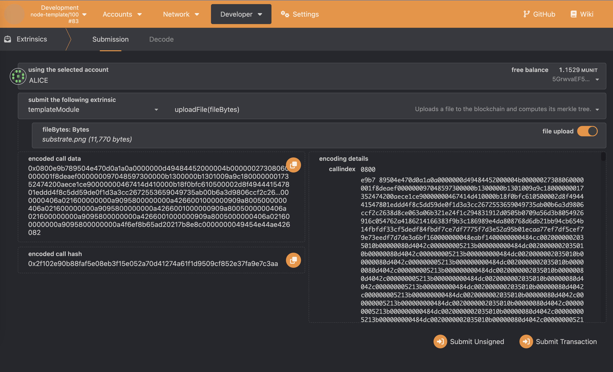
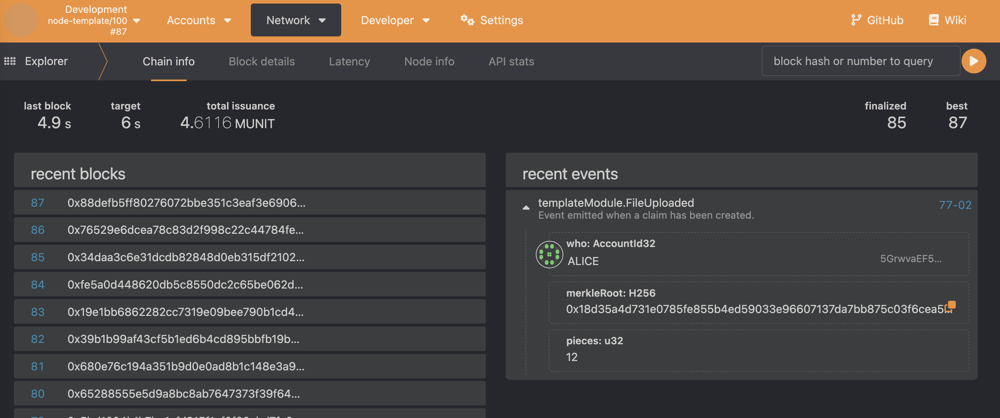

# Trustless File Server  Module

This pallet intends to be a trustless file server similar to the [Bittorrent](https://www.bittorrent.org/beps/bep_0030.html) protocol.
The main idea is to make extensive use of [merkle trees](https://brilliant.org/wiki/merkle-tree/) to provide cryptographic proofs
of the file's validity.


## Limitations

- In the original Bittorrent protocol, the `sha1` hashing algorithm is used. However, in this implementation the `sha256` is used.
- Files are divided in chunks, with a **fixed chunk size of 1KB**.
- The whole files are stored on the blockchain storage. **This is a very severe limitation and an overall bad practice**. The original idea was
to store files on IPFS and only keep the corresponding hash on the blockchain. However, I found several limitations for using IPFS
in a substrate environment, so I finally decided to store the content directly on the blockchain. Further research would be needed
in order to fix this limitation.


## Walkthrough

This pallet implementation is composed of one extrinsic and two RPC methods. Tests have been performed using
[this file](./img/substrate.png).


### Extrinsics

#### uploadFile

This pallet call accepts the file bytes and uploads them to the blockchain (see [limitations](#limitations)), along with
its corresponding merkle tree and the number of file chunks.






### RPC methods

#### template_getFiles

Returns a JSON list of the merkle hashes and number of 1KB pieces of the files being served. This operation simply
iterates through the `StorageMap` and fetches the corresponding data.

Request:
```shell
$ curl http://localhost:9933 -H "Content-Type:application/json;charset=utf-8" -d '{
     "jsonrpc": "2.0",
      "id": 1,
      "method": "template_getFiles",
      "params": []
    }'
```

Response:
```json
{
  "jsonrpc": "2.0",
  "result": [
    {
      "hash": "18d35a4d731e0785fe855b4ed59033e96607137da7bb875c03f6cea5d1f8cacf",
      "pieces": 12
    }
  ],
  "id": 1
}
```

#### template_getProof

Returns the chunk content as an hexadecimal-encoded string, along with the cryptographic proof necessary to build up
the merkle root.

Request:
```shell
$ curl http://localhost:9933 -H "Content-Type:application/json;charset=utf-8" -d '{
     "jsonrpc": "2.0",
      "id": 1,
      "method": "template_getProof",
      "params": [null, "18d35a4d731e0785fe855b4ed59033e96607137da7bb875c03f6cea5d1f8cacf", 8]
    }'
```

Response:
```json
{
  "jsonrpc": "2.0",
  "result": {
    "content": "5ac74f0ebfcca5896b67d7dcdd97f7445b7eed84da4b4e6b3dda3e9608edfb51b3b319f90f66618da6d68ce326c58ce258cabc7cd654570db3241b80dcccc002d268fa8e7e04ab26eff88ef3bdc7fe244ddeed1ec7343db5a9bfcc33e9eb1c62a035caeb3dc96ba789fdd26a3dda7ede8ca089ca3e0b6b21e9e6fa8307976417b396ba3ecb2ea276534fcd0460f2042c2095270f3cd3890ff6578a0fc8e3849ec1ddee8c6229c9b4585afcbcda6c9fdac6dd6478b55e3bcb59d6367999cfbbcc336f7efb723796b475f57d25c47beab3cfffaa00303d042c209518c87671ba7f8dc81377bbb3cd18e87f4f53b6af50d37bbb8c22be9f787ae638e2383dfbdc2f4bd7d40ea4872d179aa8acefd9559e3ad7a0977aefad5d0843717cf7ec7dbc744d1cff784f1de5c12a00e4256001e9443479a92377a7c3e111977d5dcd934ffd53c9220600d334fb6a208e55b6d90fcf3ef7ab2ae7502c455dadd7ce40ccc2ead26b300d32be6767bf119279d6ed95e29a3ad8a1381e6170cfde9f4cddcd1700042c20a9679fff6527f6ad387bee93aa9127cb40613023685aef5ec7ec8738761944c4a979ae77e5da693290c69f9b75ffa36915af79966b2a825a17ae81f83e4fbf7ba674417caf5d98dd38f8dd75f6dc9f0b00d347c002d28abd37320f426280bc675ffda51519065f4ff45efb69be7b1db31fe2d8b5bd842706844d449cb87632cf421a2cef69cae2178358116b72e2357f70f79ed62356d7668e3e79e09fd384bf1b89d735f34cac38f67f7fdf83e215c01413b080d462209ef1aeef6000de54e46933deed7fea99723ae946e735c5b1ebcf326b29623515af066226d66abc762eff3d5f1c5f116b72da8e585ddcf7284bf85ba9b8c1f29dfb1e48775dc5c31b26f1be0240bb042c20bd18e447d0c9f28139c252dce56dfa83f2a4e35dbcbe3130397e72f53c723ceed4f78fe504cfad0866110927314b24fe8e0713459c18644ee2da191844acae2cd39a061164bed33bc6939e011801a8ab0163f09a75e50104f1be19af758619d2f17e1ab3c222028a5700d34fc0023a213e28c707e63697450d3e28f71f2b3ea13bfc938a7783bbd7ab71e9c52072c46bd0b441c09964248c7dd5beb3abddc1f1f241e6a467c7f49fa2b6ef8954117c35881980937acd6356d003dfef7ec088f7fbaddfded989f3345eeb38be6d5e5783f7d338fe00ac0e0216d019f181390645f1013f82d6a4967ec5df1383ff3bbe7d4f2b1f9407f1ae89bbdd31f08801c86abf7b1d3f7bbc064d0dc6da7e9dfb4f3cfb62701ce7d1a4069c6d5f3bcbc5cfbd75c74e216b829a7cef0a711ce39a8a383a2d0f9c88f787384f1fddfbc444a2fab8dab8aee27589e36ed615c0eaf3775fdfb8e9af05a083666667ca8e3bef28bbeeb9ab6cd9747ba92d3e24c75e50c74fbe9d667034",
    "proof": [
      "ef9cb3436768bad19a78888f63ca77064e53ded49696f816523bea6e61ec36b3",
      "83c5dae86b0768e7bedcca73718523bc8bcfd7eeb6c2c728d0f035ec43aa4d63",
      "db56114e00fdd4c1f85c892bf35ac9a89289aaecb1ebd0a96cde606a748b5d71",
      "73b107c009c3044125c1f12015808b6adcfc44c473e013593f0ca1362bb80955"
    ]
  },
  "id": 1
}
```

##### Error handling:

This RPC method raises an error if the given piece does not exist or the merkle root is invalid.

Request:
```shell
$ curl http://localhost:9933 -H "Content-Type:application/json;charset=utf-8" -d '{
     "jsonrpc": "2.0",
      "id": 1,
      "method": "template_getProof",
      "params": [null, "18d35a4d731e0785fe855b4ed59033e96607137da7bb875c03f6cea5d1f8cacf", 40]
    }'
```

Response:
```json
{
  "jsonrpc": "2.0",
  "error": {
    "code": 1,
    "message": "Runtime error",
    "data": "\"Failure getting the merkle proof\""
  },
  "id": 1
}
```